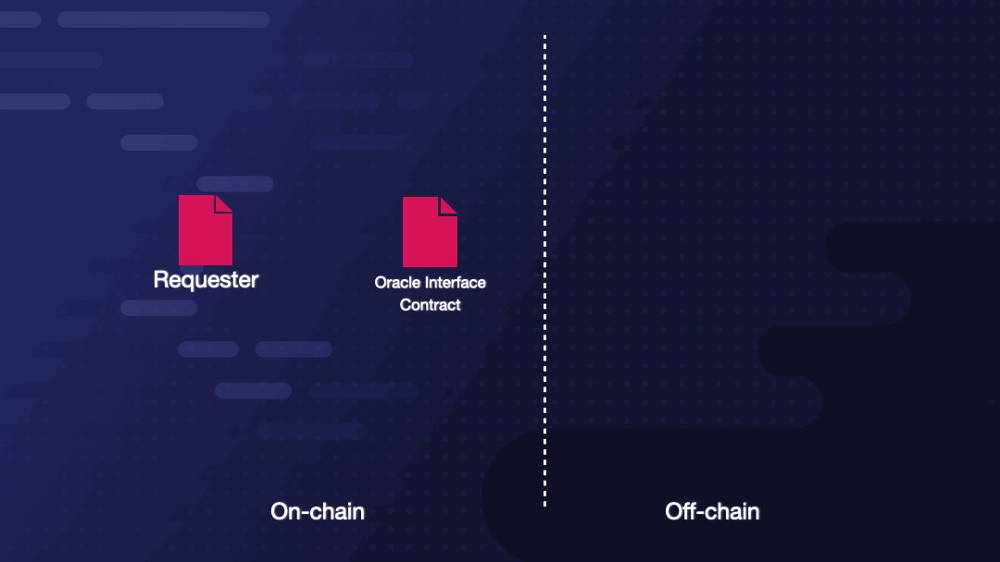

# Definitions
- ### `Oracle Function`  
> A well-defined piece of code to be executed.

- ### `Enclave`  
> A tamper-proof and encrypted environment where *Oracle Functions* can be executed confidentially and with integrity.

- ### `Portal Compute Base` (PCB) 
> The set of all *Oracle Functions* contained in an enclave. A PCB requires the following three *Oracle Functions* to be implemented: `init()`, `attest()`, `mutually_attest()`. 

- ### `Portal Node` 
> Or simply a `Portal`, is a hardware-compatible computing device loaded with a *PCB*. 

- ### `MRENCLAVE`  
> The measurement (SHA256 digest) of an enclave's state given a PCB.

- ### `Remote Attestation` (RA) 
> The process by which a *Portal Node* proves that its enclave generated a specific *MRENCLAVE*, i.e., running a specific *PCB*. 

- ### `Attestation Report` 
> A signed report that contains the attestation evidence generated during *RA*. The report includes *MRENCLAVE* and a *secp256k1* public key.

- ### `Oracle Service` 
> A contractually specified off-chain computation.

- ### `Portal Compute Oracle Network` (PCON) 
> A collection of *Portal Nodes* sharing the same *PCB* that perform an *Oracle Service*.

- ### `Requester`  
> The entity requesting an *Oracle Service*.

- ### `Oracle Interface Contract`(OIC)
> A smart contract that defines the *Oracle Service* terms. It serves as the interface between the *Requester* issuing a request and the *PCON* fulfilling the request. 

# Architecture
> We propose a generalized architecture for designing *Oracle Services*, where it is possible to create arbitrary services as long as the required functions are implemented.

## Request and Response Framework
> 
> At its core, an *Oracle Service* is a protocol where a `Requester` requests the result of an off-chain computation, and a *PCON* responds with the result. The specifics of each implementation will vary depending on the *Oracle Service*. For example, a *Requester* may issue requests via smart contract (censorship-resistant) or an off-chain interface (faster and avoids gas fees). A *PCON* response will involve one or more signatures (i.e. BLS or multisig).

> To avoid issues regarding censorship and data-availability, we focus first on purely on-chain requests and responses and leave it to future work to support off-chain requests for latency-sensitive computations. This decision means that for the following sections, all data is passed via an *Oracle Interface Contract* as depicted above.

# Portal Compute Base Specifications
> An enclave can only run the *Oracle Functions* defined in the *PCB*. This restriction allows us to place guard rails on what a *Portal Node* can do and is how we can guarantee that it performs a specific computation. The following three *Oracle Functions* are required by all *PCBs* to bootstrap *PCON* creation and add verifiability via remote attestation.

## init()
> The *Portal Node* generates a 256-bit random number called the `PCON-seed` and seals it to persistent storage. This number must remain secret. The sealing mechanism encrypts the *PCON-seed* such that the enclave can only decrypt it during computations. Since we cannot observe the contents of the enclave, *PCON-seed* remains unobservable by **anyone**.

> The purpose of *PCON-seed* is to act as the random seed for generating all of the keys used in the *PCON*. *PCON-seed* is securely distributed to all *Portal Nodes* participating in a *PCON*, which can derive the secp256k1 asymmetric keypair `PCON-PK`, and `PCON-SK`. *Requesters* can generate a symmetric key that can only be derived with knowledge of `PCON-SK` (i.e. only a valid `Portal Node` can decrypt). This key enables the creation of *Oracle Services* with end-to-end encryption.

## attest()
> The *Portal Node* performs remote attestation to prove that it is running a certain *PCB*. The generated report binds a keypair `(Portal-PK, Portal-SK)` to the node, which is used to authenticate responses.

## mutually_attest()
> In order for new *Portal Nodes* to enter a *PCON*, they will need access to the *PCON-seed*. Two *Portal Nodes* will establish a secure communication channel and exchange attestation proofs. Upon successful verification, the requesting *Portal Node* is sent the *PCON-seed*, which it seals to persistent storage.

## Custom Functions
> Any custom *Oracle Functions* specific to an *Oracle Service* can be implemented in addition to the required three. Examples include specialized compute functions like `VRF()`, `auction()`, `ai_inference()`, `ai_training()`, etc, and general compute functions like `wasm_interpreter()`, `riscv_emulator()`, `solidity_interpreter()`, `haskell_interpreter()`,`python_interpreter()`, etc.

# Oracle Interface Contract Specifications
> A *PCON* will fulfill requests by responding to events emitted on-chain. Since there may be any number of *Requesters* for a single *Oracle Service*, the *OIC* acts as a singular target for *Requesters* and *PCONs*. Each *Oracle Service* will have an instance of an *OIC*, and *Requesters* are required to include the *OIC* address in their contracts when using the service.

> Each *Oracle Service* may have a unique implementation of the *OIC* depending on the constraints of the service. Below is the abstract interface for an *OIC* with high-level summaries of the expectations of each function. 

> ## init()
>> The constructor of the *OIC*. The primary responsibility of this function is to commit to an *MRENCLAVE* value. The `portal_node_whitelist` can be populated with the wallet address derived from *PCON-PK* for certain implementations.

> ## join()
>> Upon success, this function will add the wallet address of a *Portal Node's* enclave to the *portal_node_whitelist*. 

> ## request()
>> This is the interface for a user to request an oracle service, and the parameters will vary based on the target computation. Calling this function will emit an event to notify the *PCON*.

> ## fulfill()
>> This is the interface for requests to be fulfilled by the *PCON*, and the function will only accept transactions from whitelisted wallets in *portal_node_whitelist*. The *OIC* can specify any condition for accepting a fulfillment (i.e. multisig or BLS signature).

