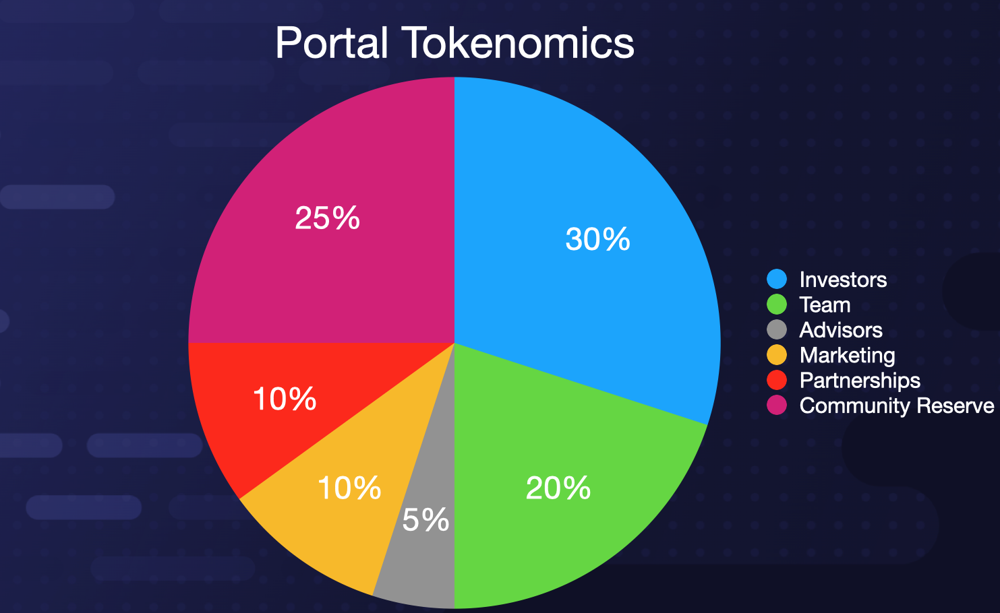

# Tokenomics

## The Portal (PRTL) Token:
>The PRTL token is the sole asset that allows users to interact with a Portal Compute Oracle Network (PCON). The PRTL token will have a max supply of 1,000,000,000 tokens upon release. These tokens will be distributed as follows: 30% to investors, 25% to the Community Reserve, 20% to the team, 10% to partnerships, 10% to marketing, and 5% to advisors. These tokens will follow a 9-month cliff period, followed by an 18-month linear vesting period, whereby tokens will be distributed every month.

## How PRTL works
>Each request made to the network will need to be coupled with a specific fee in PRTL tokens. This fee is calculated based on the size of the requested compute job, along with the network’s availability of nodes. The PRTL token is used in two ways: 

>- 1) Nodes are awarded PRTL upon fulfilling a request

>- 2) a percentage of the PRTL submitted to the network is burned out of circulation. 

>This burning mechanism allows PRTL to be deflationary, ensuring that all token holders benefit from an asset that increases in scarcity as network-use increases. Dapp developers using PRTL will need to ensure their applications have access to enough PRTL to service requests. 

## The Portal Governance Token (PGT)
>We plan to issue a Portal Governance Token (PGT) to facilitate voting for fee proposals and project direction via the Portal DAO. As we increase decentralization, a democratic process for fee distribution will be needed. PGT will be issued to Portal Nodes to allow the direction of the project to be determined by the decentralized network of nodes that service our customers.

>

